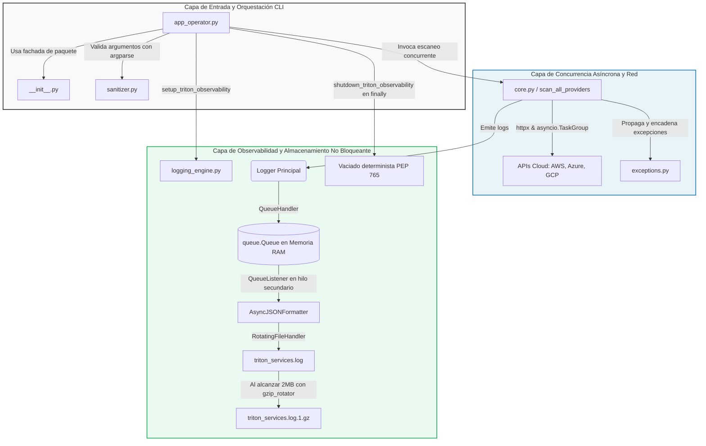

# 🚀 Proyecto Tritón: Sistema de Telemetría Multicloud y Observabilidad Asíncrona

Este repositorio contiene la implementación oficial de **TritonMonitor**, una herramienta de línea de comandos (CLI) de grado industrial diseñada para recolectar telemetría en tiempo real desde múltiples proveedores cloud (AWS, Azure y GCP) bajo condiciones extremas y tormentas de radiación simuladas.

El sistema destaca por su enfoque en programación asíncrona, robustez en la frontera CLI, persistencia de datos no bloqueante con compresión idempotente y control quirúrgico de fallos concurrentes mediante grupos de excepciones (`ExceptionGroup` y `except*`).

---

## 👥 Estructura del Equipo y Roles

| Integrante | Rol Técnico | Responsabilidades Principales |
| :--- | :--- | :--- |
| **Integrante 1** | Ingeniero de Robustez y Excepciones | Excepciones semánticas (`exceptions.py`) y sanitización temprana en `argparse` (`sanitizer.py`). |
| **Integrante 2** | Ingeniero de Concurrencia | Motor de red asíncrono con `httpx` y orquestación paralela con `asyncio.TaskGroup` (`core.py`). |
| **Integrante 3** | Ingeniero de Formateo JSON | Serialización recursiva forense de `ExceptionGroups` y metadatos dinámicos en formato NDJSON (`logging_engine.py`). |
| **Integrante 4** | Ingeniero de Almacenamiento | Pipeline asíncrono no bloqueante (`QueueHandler/Listener`) y rollover GZIP con Hardening de Idempotencia. |
| **Integrante 5** | Coordinador de Integración y CLI | Punto de entrada CLI, inyección de validadores, captura quirúrgica y limpieza PEP 765 (`app_operator.py`). |
| **Integrante 6** | Ingeniero de Caos y Forense | Suite automatizada de inyección de fallas concurrentes (`chaos_test.py`) y auditoría forense de descompresión `.gz` (`forensic_test.py`)[cite: 3]. |

---

## 🏗️ Arquitectura de Observabilidad y Hilos (Desacoplamiento I/O)

Para evitar que las operaciones de entrada/salida (I/O) en disco ralenticen el bucle de eventos asíncrono principal (*Event Loop*), el sistema implementa un modelo de **cola thread-safe** en memoria[cite: 3]. 

Los logs estructurados en JSON se depositan casi de manera instantánea en una cola en RAM, delegando la tarea de escritura física y rotación en disco a un hilo secundario desatendido de manera asíncrona[cite: 3].

🛠️ Requisitos Previos e Instalación
Siga estas instrucciones para configurar su entorno de desarrollo local y reproducir la ejecución de forma totalmente aislada garantizando las dependencias (ej. httpx)[cite: 3].

1. Clonar el Repositorio 

git clone [https://github.com/tu-usuario/proyecto_triton.git](https://github.com/tu-usuario/proyecto_triton.git)
cd proyecto_triton

2. Crear y Activar el Entorno Virtual (venv)
En Linux / macOS:

python3 -m venv venv
source venv/bin/activate

En Windows (PowerShell):

python -m venv venv
venv\Scripts\Activate.ps1

3. Instalar Dependencias

pip install --upgrade pip
pip install -r requirements.txt

💻 Comandos de Ejecución (Guía de Pruebas)El programa oficial de la CLI debe ejecutarse siempre como un módulo desde la raíz del proyecto para evitar errores de importación y protegernos contra el Local Shadowing.  Escenario A: Operación Nominal Completa (Éxito Rotundo)Ejecuta la CLI consultando los proveedores de nube con parámetros nominales[cite: 3]:

python -m src.app_operator --mode nominal --timeout 4.5 --cluster cluster-us-east-01

Comportamiento esperado: Las llamadas se paralelizan. Verás salir los logs estructurados JSON por la consola y se creará físicamente el archivo triton_services.log[cite: 3].

Escenario B: Validación Temprana (Frontera CLI)
Prueba la sanitización de argumentos ingresando un timeout fuera del rango permitido de 0.1 a 5.0 segundos[cite: 3]:

python -m src.app_operator --timeout 9.9

Comportamiento esperado: La aplicación aborta inmediatamente antes de levantar el bucle asíncrono, lanzando un error de argparse y saliendo limpiamente con código de estado 2[cite: 3].

Escenario C: Inyección de Caos (Tormenta de Errores)
Fuerza un fallo masivo reduciendo drásticamente el timeout de red para provocar latencias artificiales[cite: 3]:

python -m src.app_operator --mode emergency --timeout 0.1

Comportamiento esperado: El sistema levantará un ExceptionGroup con los errores de red concurrentes. El logger capturará y formateará de manera recursiva la jerarquía de excepciones en un objeto JSON sin corromper la memoria[cite: 3].

🧪 Pruebas Automatizadas SRE (Suite Forense)
El proyecto incluye una suite de ingeniería de caos para estrés concurrente y validación de compresión de logs. Ejecútelos desde la raíz:

Simulación de Caos (Múltiples procesos CLI):

python tests/chaos_test.py --runs 12 --workers 4

Auditoría Forense de Logs (Validación de JSON y GZIP):

python tests/forensic_test.py

📐 Estándar de Código Limpio y Linters (PEP 8)El código cumple con los más altos estándares estilísticos (PEP 8). Para comprobar de forma automatizada la calidad del software antes de hacer entregas:  

# Análisis estilístico PEP 8 con Flake8
flake8 src/ tests/

# Análisis lógico, de variables y puntuación de calidad con Pylint
pylint src/ tests/

